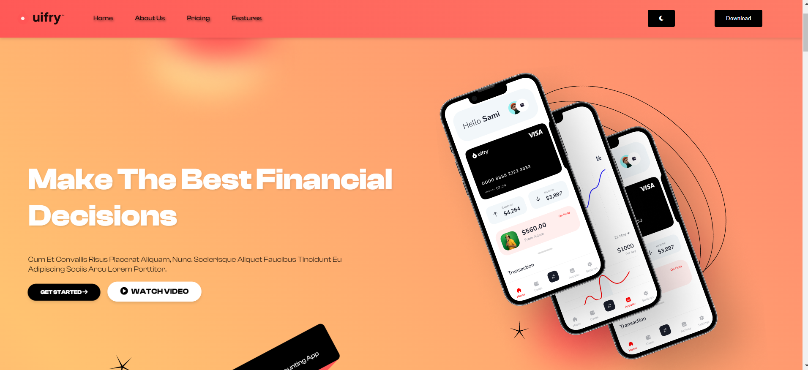
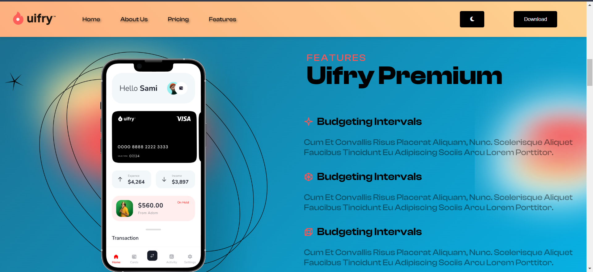
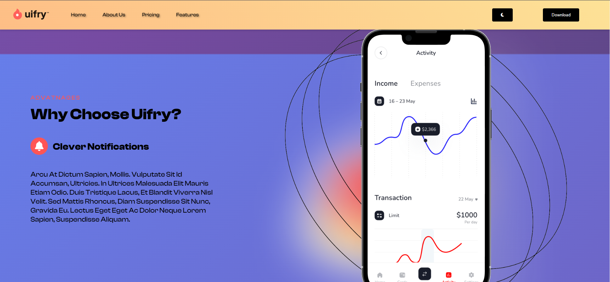
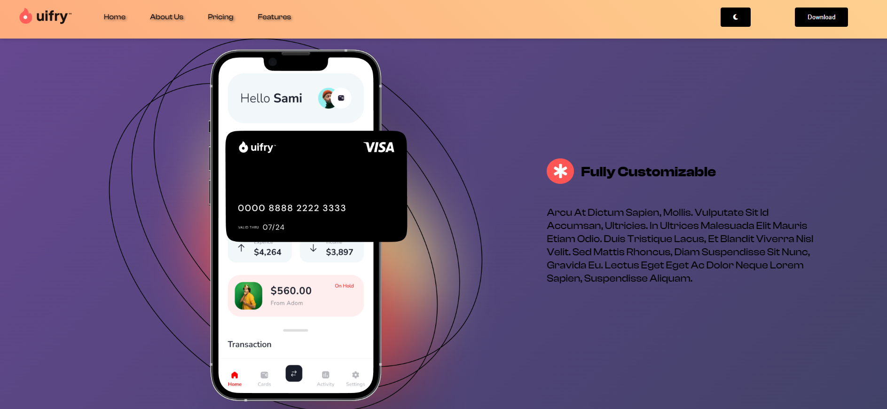
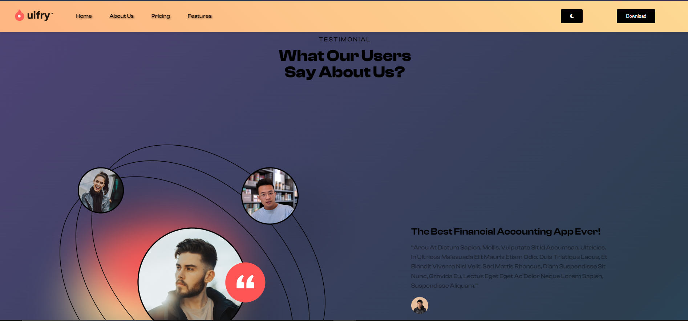
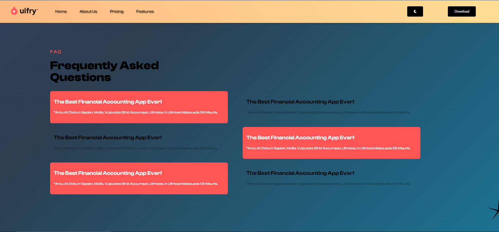
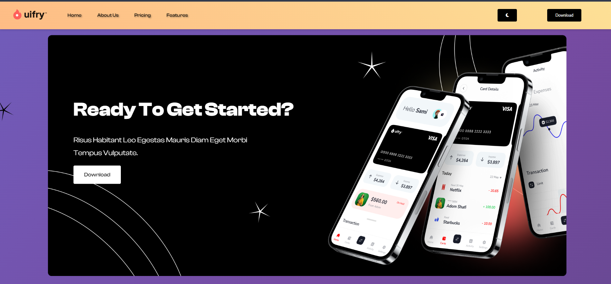
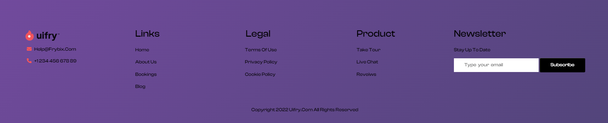

# Awesome App Landing Page

Welcome to the Awesome App Landing Page project! 🚀

## Overview

This project is a responsive landing page for a mobile application, designed using HTML, CSS, and JavaScript. 

## Design Reference

🎨 [Figma Design](https://www.figma.com/design/Uj9dMpuhWWluiUddQIeZu4/App-Landing-Page-Finance-Bank-Money-(Community)?node-id=1-29&t=KgfoqKc89ch5pJH6-0) - Check out the design reference for this project.

## Live Demo

🔗 [Live Demo](https://app-landing-page-alpha.vercel.app/) - View the live demo of the app landing page.

## Screenshots

## Features

✨ Responsive layout optimized for both desktop and mobile devices.
✨ CSS Grid and Flexbox for flexible and dynamic page layout.
✨ Interactive elements with smooth hover effects.
✨ Dark mode toggle for enhanced user experience.
✨ Data fetched from a local JSON file for dynamic content.

## Setup Instructions

To run this project locally, follow these steps:

1. Clone the repository: `git clone https://github.com/your-username/awesome-app-landing.git`
2. Navigate to the project directory: `cd awesome-app-landing`
3. Open the index.html file in your web browser.

## Technologies Used

- HTML5
- CSS3
- JavaScript
- Next.js (optional)
- TypeScript (optional)

## Credits

- Icons: [Font Awesome](https://fontawesome.com/)
- Fonts: [Google Fonts](https://fonts.google.com/)
- Images: [Unsplash](https://unsplash.com/)

## Contributing

Contributions are welcome! Feel free to submit a pull request or open an issue for any improvements or bug fixes.

## License

This project is licensed under the MIT License - see the [LICENSE](/LICENSE) file for details.
